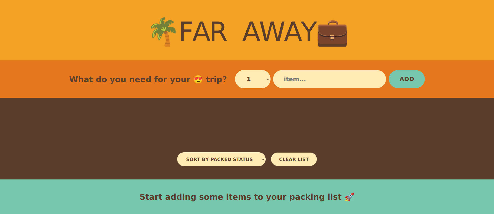
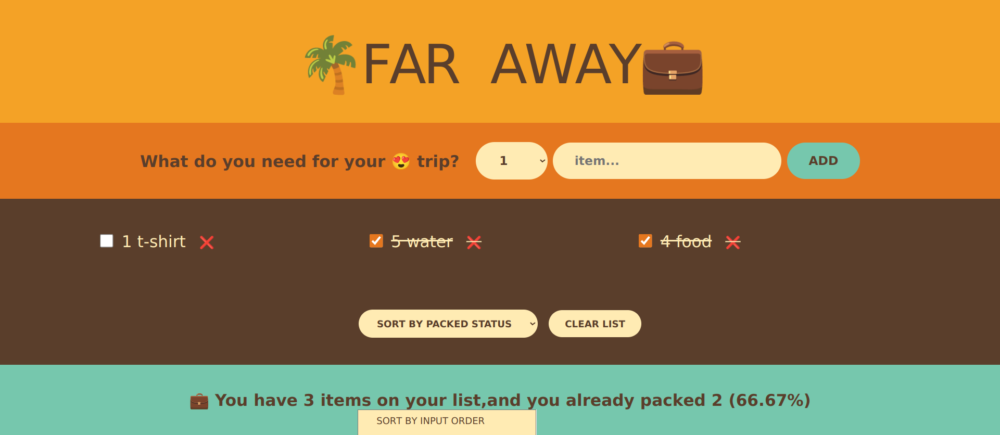

# 🌴 Travel List

  

## Table of Contents

  

- [Table of Contents](#table-of-contents)

- [👋Introduction](#introduction)

- [🌟Features](#features)

- [🚀 Live Project](#-live-project)

- [📸 Screenshots](#-screenshots)

- [💡Technique Skills](#Technique-skills)

- [🛠️Technologies Used](#️technologies-used)

- [🏁Getting Started](#getting-started)

- [⬇️Installation](#️installation)

- [🔧Usage](#usage)

- [📄License](#license)

  

## 👋Introduction

  

The Travel List project is a web application that helps users to manage a packing list for their travels.

  

## 🌟Features

  

- Add Items: Users can add items to the packing list using the form.

- Sort Items: Users can sort items by input order, description, or packed status.

- Mark as Packed: Users can mark items as packed.

- Delete Items: Users can delete individual items or clear the entire list.

- View Statistics: Users can view statistics about the packing list, such as the percentage of items packed.

  
  

## 🚀 Live project

  

[🌴 Travel List](https://travel-list-inky.vercel.app/)

  

## 📸 Screenshots

  






## 💡Technique Skills
- **DOM and Event Handling**
i handled DOM updates through React's JSX syntax.

 ```
 return (

<div  className="stats ">

<span>

{presntagePacked() === 100

? "You got everything! Ready to go ✈️"

: `💼 You have ${

addItems.length

} items on your list,and you already packed ${packedItems} (${presntagePacked()}%)`}

</span>

</div>

);
```
- **TypeScript**
i used TypeScript for type safety
```
export  interface  items {

id:  number;

description:  string;

quantity:  number;

packed:  boolean;

}
```
- **State Management**
managing state using React's useState.


```
const [addItems, setAddItems] =  useState<items[]>([] as  items[]);
```
- **Reusable Components**
created reusable components like logo.
```
const  Logo  = () => {
return (
<h1>🌴Far Away💼</h1>
)}
export  default  Logo
```
- **Array and Objects**
 used array methods like  filter.
 ```
let packedItems = addItems.filter((item) => item.packed).length;
 ```
- **JavaScript + ES6**
used modern JavaScript features like arrow functions and template literals.
```
const presntagePacked = () => {
  let result = (packedItems / addItems.length) * 100;

  return Number.isNaN(result)
    ? 0
    : Number.isInteger(result)
    ? result
    : result.toFixed(2);
};
```
## 🛠️Technologies Used

  

The Travel List project utilizes the following technologies:

  

-    &nbsp;  &nbsp;[Html](https://html.com/)

-    &nbsp;  &nbsp;[Css](https://www.w3.org/Style/CSS/Overview.en.html)

-    &nbsp;  &nbsp;[React](https://reactjs.org/)

-    &nbsp;  &nbsp;[TypeScript](https://www.typescriptlang.org/)

  

## 🏁Getting Started

  

To set up the Travel List project locally, follow the instructions below.

  

## ⬇️Installation

  

To set up the project locally, follow these steps:

  

1. Clone the repository:

  

```bash

git clone https://github.com/Abdelrahman-wahed/travel-list.git

```

  

2. Navigate to the project directory:

```bash

cd travel-list

```

  

3. Install the required dependencies:

  

```bash

npm install

```

  

## 🔧Usage

  

1. Run the development server:

  

```bash

npm start

```

  

2. Open your browser and go to `http://localhost:3000` to view the application.

  

## License

  

This project is licensed under the MIT License - see the [LICENSE](LICENSE.md) file for details.